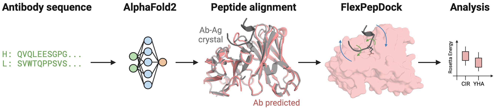

# FlexPepDock with Noncanonical Amino Acids
Official repository for `Computational analysis of the effects of somatic mutations on Anti-Citrullinated Protein Antibody antigen-binding specificity`. This repository provides all scripts for mutating residues from canonical to noncanonical, antibody peptide complexes, and scirpts for FlexPepDock refine scoring.



## Command line usage

This repository provides parameter files for the NCAAs citrulline and homocitrulline and supports residue mutations with the Rosetta MutateResidue mover and FlexPepDock scoring with FlexPepDock Refine.

### Mutate residues with MutateResidue mover

An example command line script for creating NCAA-containing peptides from CAA peptides is provided below

```bash
$ /PATH_TO_ROSETTA/main/source/bin/rosetta_scripts.default.macosclangrelease -s [NAME.pdb] -extra_res_fa /PATH_TO_ROSETTA/main/database/chemical/residue_type_sets/fa_standard/residue_types/l-ncaa/CIR.params -parser:protocol mutate_one.xml
```

### FlexPepDock refinement

Details of the FlexPepDock refinement protocol can be found from the [RosettaCommons documents page](https://www.rosettacommons.org/docs/latest/application_documentation/docking/flex-pep-dock).

Run the prepack method as follows:

```bash
$ /PATH_TO_ROSETTA/main/source/bin/FlexPepDocking.default.macosclangrelease @flags/prepack_flags >output/ppk.log
```

Run refine method as follows:

```bash
$ /PATH_TO_ROSETTA/main/source/bin/FlexPepDocking.default.macosclangrelease @flags/refine_flags >refine.log
```


